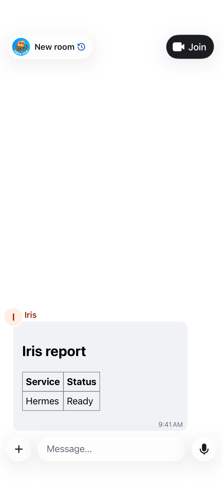
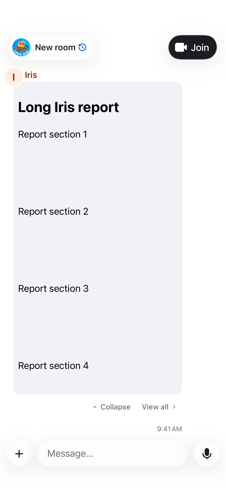
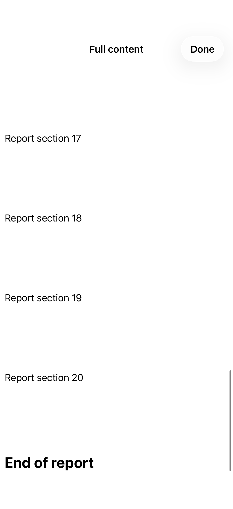
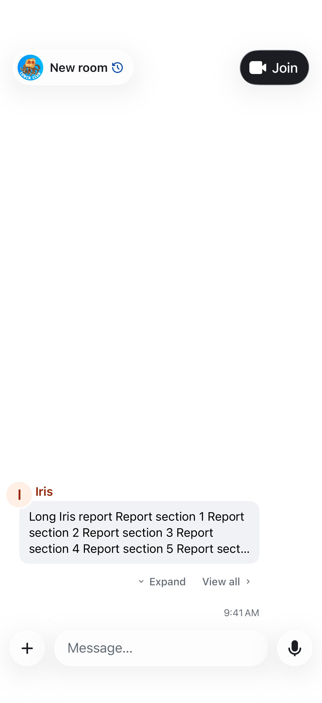

# Static HTML cards

In an empty chat composer, choose **+ → HTML card**, paste HTML, select **Preview
card**, then Send. The recipient sees the card inside the timeline bubble without
opening a document or a browser. The preview is required before sending; changing
the source invalidates it. Existing text drafts, replies, and edits keep their
ordinary composer workflow.

## Supported content

Static HTML and inline CSS support headings, tables, lists, code, colours, and
layout. Embedded PNG/JPEG/WebP data images work within the document size limit.
External images, Matrix media URLs inside HTML, fonts, links, JavaScript, forms,
SVG, frames, and other embedded applications are not enabled in this first version.
Use normal encrypted image messages for large images. No HTML resources are
fetched from a third party or from Iris.

The source and sanitised fragment are limited to 16,000 UTF-8 bytes; encoded
extension JSON is limited to 32,000 bytes to leave room for the ordinary message
body and Matrix encryption overhead. Inline cards grow with their content up to the current visible viewport, with
space reserved for the sender, timestamp and a **View all** button. They do not
scroll, select text, or intercept touches, including inside CSS scroll containers.
Vertical or horizontal overflow shows the button below the preview. It opens a
full-screen internal reader where the complete document can scroll; Done returns
to the same chat. Window size and rotation update the preview limit. Invalid/unknown card payloads retain the standard message
body. A WebKit rendering failure explicitly shows an error and the message summary.

## Wire format

Cards are ordinary `m.room.message` events with `msgtype: m.text` and a readable
`body`, plus this versioned extension in the event content:

```json
{
  "msgtype": "m.text",
  "body": "Report: Ready",
  "art.irisr.html": {
    "version": 1,
    "html": "<h2>Report</h2><p>Ready</p>",
    "summary": "Report: Ready"
  }
}
```

The existing Rust SDK send queue handles delivery and room encryption through
`sendWithExtraContent`. There is no separate upload, public hosting URL, or server
change. The timeline reads the extension from the SDK's latest event JSON and
sanitises again before rendering. Until a remote echo arrives, the SDK does not
expose that JSON, so the sender's local echo shows the ordinary summary. Unmodified
clients also show the summary. The fork disables ordinary text editing of cards;
forwarding through clients that discard extension fields may retain only the
summary. Reply quotations remain text summaries.

## Containment

The preview and full-content reader each use a separate nonpersistent WKWebView.
Both set the cookie policy to `disallow` before loading, and do not share a website
data store or Safari cookies. Closing the reader discards its view and temporary
store. Page JavaScript is disabled;
there are no script message bridges or injected scripts. A fixed CSP blocks
connections, frames, fonts, scripts, external styles and external images. Only
inline CSS and embedded image data are permitted. Navigation is limited to the
locally loaded `about:blank` document; link previews and data detectors are off.
HTML tags and attributes are separately allowlisted. The view is confined to its
message bubble and the web view is stopped when removed.

Tests cover payload round trips, latest edits, sanitisation, size limits, the
message factory and composer handoff, WebKit script/resource containment, and the
real room's inline card/editor preview UI. These tests use local fixtures; a
real-account encrypted send/receive and device network capture remain deployment
validation tasks.



Validation environment: Xcode 26.6 / iOS 26.5 simulator. Focused tests cover
preview limits and both overflow directions, inline gesture policy, separate
nonpersistent browser stores, cookie rejection before loading, and script/resource
containment. UI tests cover short cards, the composer preview, long reports,
rotation, full-content scrolling and returning to the chat.

The preview/reader update passes 10 focused unit/WebKit tests and 2 UI tests,
including orientation changes. SwiftFormat and SwiftLint pass for the changes.





Each card starts expanded and has a Collapse button. Collapsing replaces WebKit
with a native summary of at most three lines, retaining the preview's 300-point
width (or the available width on narrow layouts). Expand restores the preview;
View all opens the private reader directly from the summary. Returning
from the reader preserves the collapsed state.

Collapsed event IDs are held in the current timeline view model, so recycling a
message view does not reset the choice. This is local UI state: reopening the
room starts expanded and no preference or message edit is sent to the server.

The collapse update passes 48 unit/WebKit tests and 3 UI tests, including
summary expansion, opening the reader while collapsed, and returning to the
collapsed message. SwiftFormat and SwiftLint pass for the changed files.



Card actions use secondary-colour footnote labels and small directional chevrons,
with no filled button chrome. Each action retains a 44-point minimum hit height.
The refined controls pass all three card UI flows, including rotation.

Expand/Collapse and View all are grouped below the card, aligned to its trailing
edge on the chat background. Only the HTML or summary has a card surface. The
timestamp remains separate below the actions. Fixed-width cards also remeasure
the viewport after device rotation, even when their own width is unchanged.
