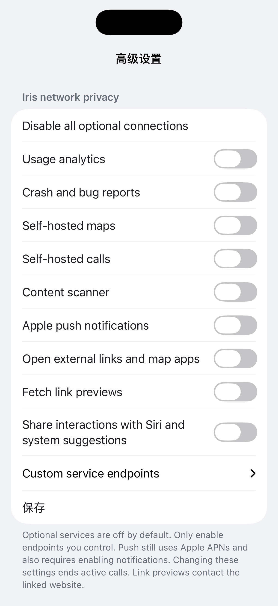

# Iris iOS network policy

This fork starts from upstream `develop` at `5d050f6dfccd899aef771c2489607efe95e8e0e9`.
The product is Element X iOS, not Element Web. Work belongs on `iris-main` in
`NeoeticAnchor/element-x-ios`; the local `upstream` remote has push disabled.

## Configuration and settings

Open **Settings → Advanced settings → Iris network privacy**. All optional
connections default to off. Expand **Custom service endpoints**, configure the
HTTPS endpoints, enable the desired services, then Save. **Disable all optional
connections** saves immediately while retaining endpoint values for later use.
Settings are device-local and shared with the Notification Service Extension.
Only public project keys belong here; do not enter administrator credentials.

| Connection | Routing and shutdown |
| --- | --- |
| Chat, media, encryption keys | Default account provider is `hermes.irisr.art`. Normal Matrix operations continue when optional services are disabled. |
| PostHog | Explicit HTTPS host and project key; also requires analytics consent. Configuration changes stop the previous client. No bundled official host/key is used. |
| Sentry | Explicit self-hosted DSN and reports switch; changing configuration closes the previous client. Disabled in Debug builds. |
| Rust crash reporting | Automatic Sentry transport removed from the app configuration because its lifetime cannot be stopped independently; local Rust logs remain available for explicit Rageshake submission. |
| Rageshake | Explicit submission URL; disabling cancels the current upload and removes the upload destination. Remote settings cannot reactivate it. |
| Maps | Explicit MapTiler-compatible base URL, styles and optional key; empty key supports keyless self-hosting. Disabled maps use existing local placeholders. Remote overrides cannot reactivate them. |
| Element Call | Explicit HTTPS app URL. The embedded app/public fallback is not used to start a call. Network changes dismiss the current call. PostHog and Sentry parameters use configured endpoints only. Configure the call server's LiveKit/SFU/TURN endpoints on that server. |
| Content scanning | Explicit scanner URL; applies to the SDK and direct scanning. Disabling disconnects the SDK scanner; old proxy instances refuse new scans. Remote overrides cannot reactivate it. |
| Notifications | Explicit Sygnal base URL, using `/_matrix/push/v1/notify`. Also requires the normal notifications setting and iOS permission. Disable unregisters APNs and deletes the pusher. Failed deletion retains its token and retries on foreground/session restoration. |
| VoIP PushKit | Registers only with both calls and push enabled; disabling clears desired push types. |
| Link previews | Optional direct website access through Apple's metadata provider; off returns empty metadata and cancels active providers. |
| Siri/system suggestions | Explicit switch; disables outgoing interaction donation and clears the app's previously donated interactions on setting changes. |
| External links/maps/App Store | Optional explicit handoff, disabled by default. Internal Matrix links and operator-hosted help remain available. Location sharing exports a `geo:` string without loading an Apple Maps URL as preview metadata. |
| OAuth/help/associated domains | Operator domain replaces official Element defaults. Configure actual OAuth metadata and the AASA file before enabling MAS; no Apple team or signing credentials are committed. |

## Server verification and remaining deployment work

Read-only inspection of `ssh iris` found Synapse, PostgreSQL and Element Web under
`/opt/guiming-matrix`, with `https://hermes.irisr.art` as the homeserver and
`report_stats: false`. No Sygnal, LiveKit/TURN, map, PostHog or Sentry service was
verified. Their endpoints are intentionally blank. No server settings were changed.

Self-hosting Sygnal does not replace Apple APNs. Apple delivery and OS traffic,
Matrix metadata, endpoint security, federation, and services referenced transitively
by a map style/call server are separate deployment boundaries. This is not a VPN or
an OS firewall. Previously delivered data cannot be recalled, and disabling a
service cannot retract a request already received by its server.

The fork uses `art.irisr.iris` and `group.art.irisr.iris`. Supply your own Apple
Development Team, provisioning profiles, APNs credentials and AASA association for
real-device distribution. Element Classic account-import identifiers and entitlements are removed, so the fork does not probe the official app's accounts. The configured operator help/OAuth paths must be hosted
before those features are used. Runtime account testing and device packet capture
are required before asserting that a specific deployed installation has no
unexpected outbound traffic.

## Validation

Validated with Xcode 26.6 and the iOS 26.5 simulator: the app and Notification
Service Extension build successfully, 19 focused unit tests pass, and the UI test
passes after enabling analytics/reports and using the single disable-all action.
SwiftFormat lint also passes. These checks do not replace real-account network
capture or validation of a signed device build.

## Personal development builds and session persistence

A local Personal Team build can omit unsupported notification, associated-domain
and app-group entitlements and exclude the notification/share extensions. This is
an installation variant, not the production entitlement configuration. Without an
app group, session files use the app data container, which iOS can relocate when
updating the app.

Restoration tokens therefore resolve recognised UUID session paths under the
current data/cache roots before checking the crypto database or creating the SDK
client. A failed restoration preserves credentials and files. If another login
replaces that session, its prior restoration token is retained in a separate
keychain recovery service, excluded from normal login selection. Explicit logout
or reset removes the corresponding recovery credentials too.

Do not uninstall, reset encryption, or delete key backups to troubleshoot an
update requiring login. Preserve existing data first. An old crypto database
still needs its local store passphrase; a server key backup needs the user's
recovery key. Finding either database alone does not prove its keys are recoverable.
